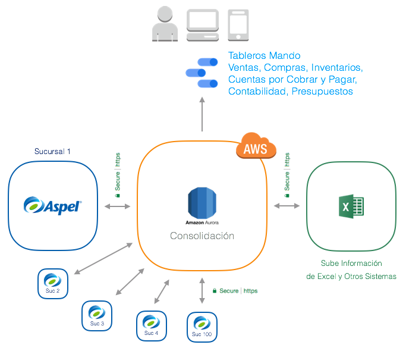

## Aspel SAE


Integramos Aspel con Amazon Web Services para crear tableros de mando con indicadores de gestión y seguimiento diario y desarrollar soluciones a la medida.

Consolidamos también información de distintas sucursales que utilizan bases de datos separadas de Aspel, de razones sociales distintas y de la misma razón social.

Buscas un Business Intelligence? Escríbemos! [info@factorbi.com](mailto:info@factorbi.com)

<a href="https://www.factorbi.com/?lang=es" target="_blank">www.factorbi.com</a>

---

## Demo Business Intelligence

<a href="https://datastudio.google.com/open/1rLJVp6XI-JnVkBVOnkdooT3IAVzl_GKW" target="_blank">Tablero de Mando Aspel SAE</a>

<a href="https://datastudio.google.com/open/1rLJVp6XI-JnVkBVOnkdooT3IAVzl_GKW" target="_blank">

</a>

---

## Consolidación

Consolida información de Aspel de distintas razones sociales y sucursales que utilizan bases de datos independientes. Sube información de Excel como metas de ventas y presupuestos para realizar un análisis completo.



---

## Excel Tablas Aspel SAE

<a href="http://bit.ly/tablas_aspel" target="_blank"></a> Abre aquí [**Excel tablas Aspel SAE.**](http://bit.ly/tablas_aspel)

**NOTA:** La lista del link anterior puede no estar completa.

Para obtener el listado completo de tablas de acuerdo a tu base de datos, puedes usar el siguiente query en Firebird:

```sql
select rdb$relation_name
from rdb$relations
where rdb$view_blr is null
and (rdb$system_flag is null or rdb$system_flag = 0)
order by rdb$relation_name;
```

---

## Contacto

¿Necesitas ayuda? Escríbemos! [info@factorbi.com](mailto:info@factorbi.com)