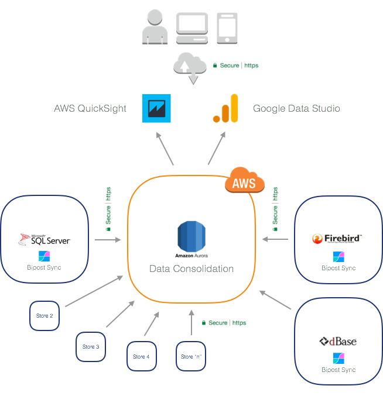

## Use Case

Use Bipost Sync to power your company with cloud Dashboards and KPI's using [Google Data Studio](https://www.google.com/analytics/data-studio/) or [AWS QuickSight](https://aws.amazon.com/quicksight/)

**Want to see a demo?** Go to --> [Google Data Studio Demo.](https://datastudio.google.com/open/10DcPMQ3tHwrsny2R4GXwNP-AsRCTjBJp)

---

## Contact Us

Interested? Send us an email: [info@factorbi.com](mailto:info@factorbi.com)