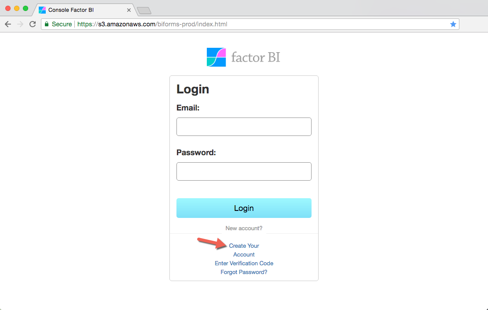
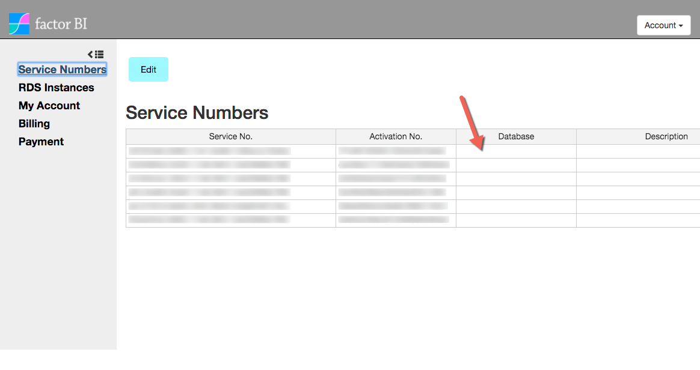
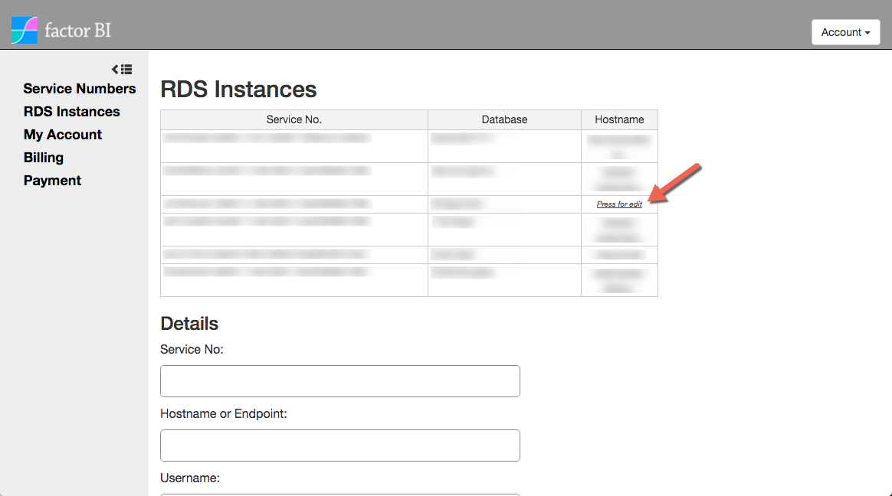

## Create your Account

Open **<a href="https://s3.amazonaws.com/biforms-prod/index.html" target="_blank">Factor BI Console.</a>**

Click **Create Your Account** and follow steps.

Password must be at least 8 characters containing uppercase and lowercase letters, numbers and symbols.

---

## Configure your first service

1.  Log in to the <a href="https://s3.amazonaws.com/biforms-prod/index.html" target="_blank">Console.</a>
2.  On the left pane, go to **Service Numbers**, click **Edit** then **New**.
3.  Edit **Database** and **Description**, then click **Edit** again to save.

    **Database must be all lowercase. Can't contain special characters.**

    

4.  Go to left pane **RDS Instances** and click under **Hostname**.

    Fill the following fields with the information you have on **Outputs** tab, [Step 4.5](/easyawssetup#45-resources-created):

    *   Hostname or Endpoint
    *   Username
    *   Password
    *   Port

    

---

## Download Bipost Sync

[Download Bipost Sync for Windows.](/installation)
