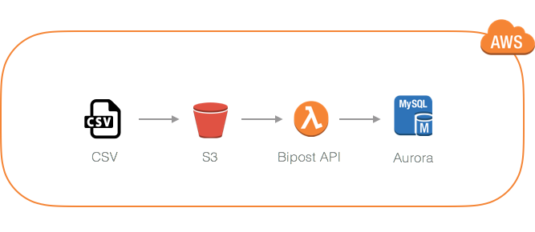

## CSV to MySQL Aurora

If your are looking for:

*   An API to continually load CSV files to MySQL.
*   Dynamically create/alter schema tables according to CSV structure.
*   Put CSV objects on S3 and dynamically call LOAD DATA FROM S3 to MySQL.
*   A cloud managed solution.
*   Pay only for what you use.

Tell us about your project. We can help --> [info@factorbi.com](mailto:info@factorbi.com)