## Link your AWS Account

**This is the easiest and recommended way to link your AWS Account to Bipost API.**

IMPORTANT NOTICE: If you are planning to use Bipost Sync for production you may want to follow your IT department policies and use AWS security according to your needs.

---

## Step 1: Have an AWS Account?

**If you don't have an AWS Account please proceed:**

1.  Create an AWS Account here [aws.amazon.com](http://aws.amazon.com)
    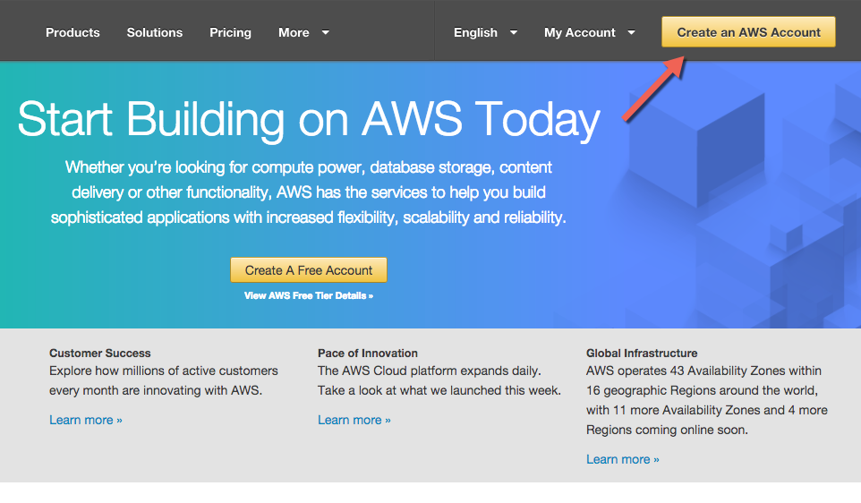

2.  AWS usually makes an automated verification phone call, we suggest to provide a land line.

3.  Provide payment information.

4.  Select Basic Support (free plan).

5.  Congrats you have an AWS account!

Need Help? [--> Write us.](mailto:info@factorbi.com)

---

## Step 2: Canonical User ID

Logged in to AWS Account:

1.  Upper right corner of your AWS console, click your account name (or follow next link).
2.  [My Security Credentials.](https://console.aws.amazon.com/iam/home#/security_credential)
3.  Click *Continue to Security Credentials* if dialog appears.
4.  Expand Account Identifiers.
5.  Copy AWS Account ID (12-digit) and Canonical User ID (64-digit).
    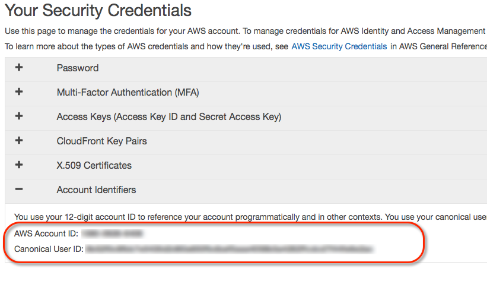
6.  Email these numbers to [info@factorbi.com](mailto:info@factorbi.com) so we can setup your dedicated Bucket.

**Please stop here until you get a reply email from Factor BI.** We will provide your **bucket name** which will be used on further steps.

---

## Step 3: Closest AWS Region

**[cloudping.info](http://cloudping.info)**

*   Click the above link and hit **HTTP Ping** and look for the lowest latency.
*   Maybe you want to try this at different times of the day.
*   Take note of the closest region.

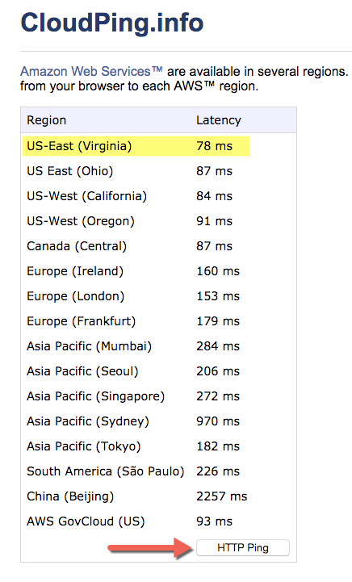

---

## Step 4: CloudFormation

Based on the result from previous step, click the icon that is the closest Region to your location.

| AWS Region                | Short name     |                                                                                                                                                                                 |
| ------------------------- | -------------- | ------------------------------------------------------------------------------------------------------------------------------------------------------------------------------- |
| US East (N. Virginia)     | us-east-1      |  |
| US East (Ohio)            | us-east-2      |  |
| US West (California)      | us-west-1      |  |
| US West (Oregon)          | us-west-2      |  |
| Canada (Central)          | ca-central-1   |  |
| Europe (Ireland)          | eu-west-1      |  |
| Europe (London)           | eu-west-2      |  |
| Europe (Frankfurt)        | eu-central-1   |  |
| Europe (Paris)            | eu-west-3      |  |
| Asia Pacific (Mumbai)     | ap-south-1     |  |
| Asia Pacific (Seoul)      | ap-northeast-2 |  |
| Asia Pacific (Singapore)  | ap-southeast-1 |  |
| Asia Pacific (Sydney)     | ap-southeast-2 |  |
| Asia Pacific (Tokyo)      | ap-northeast-1 |  |
| South America (São Paulo) | sa-east-1      |  |

### 4.1. Select Template

*   The template must be already selected, click **Next** lower-right blue button.

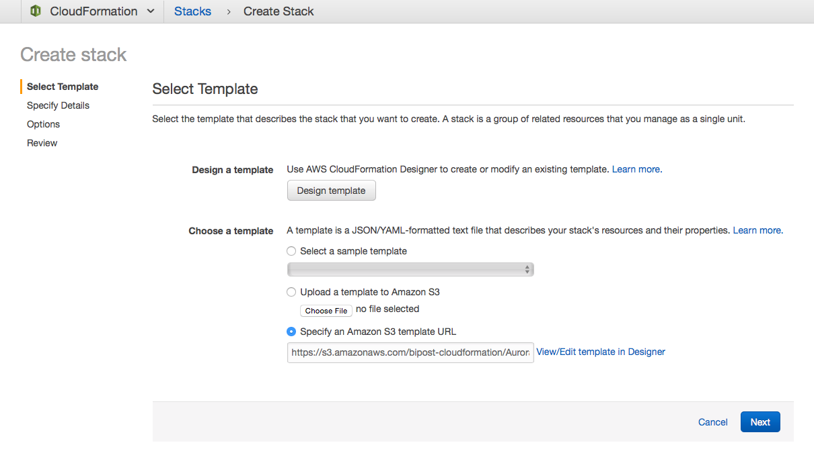

### 4.2. Specify Details

*   **Stack Name:** this will be the prefix of all provisioned services. Example: `mycompany-prod`
*   **BucketName:** Paste the S3 bucket name that your received from Factor BI over email. It must look like this: `bipostdata-acb123456789012`
*   **DBAdminPassword:** Type a complex password. Must be at least 8 characters containing uppercase and lowercase letters, numbers and symbols.
    > Password must be at least eight characters long. Can be any printable ASCII character except "/", """, or "@".
*   **DBAdminUsername:** Database Admin Username, example: `root`
*   **DBInstanceClass:** for testing purposes select the smallest available, currently `db.t2.small`
*   **Environment:** Text to be included in the database cluster name.
*   **PublicSubnetACIDR:** Leave default. Only modify the subnet address if multiple environments are needed, example: `10.20.10.0/24`
*   **PublicSubnetBCIDR:** Leave default. Only modify the subnet address if multiple environments are needed, example: `10.20.20.0/24`
*   **SubnetsAZ:** Select two availability zones to create the resources.
*   **VPCCIDR:** Leave default. Only modify the address if multiple environment are needed, example: `10.20.0.0/16`
*   Click **Next**, blue button blue button.

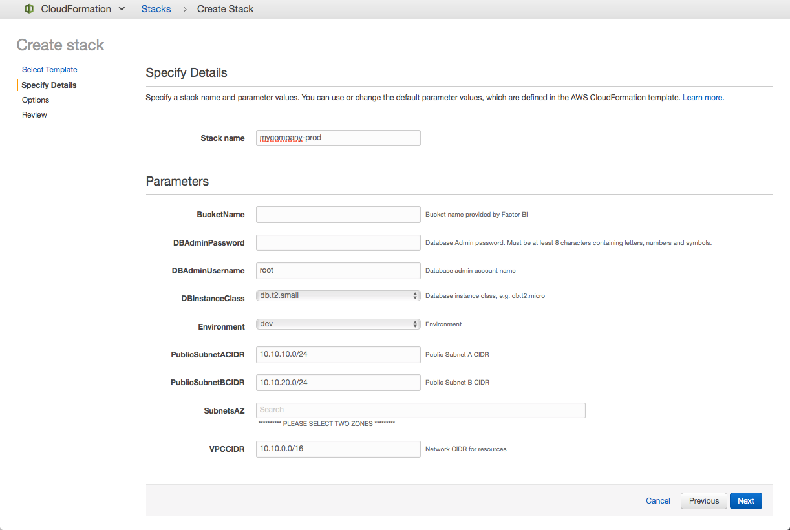

### 4.3. Options

*   Leave all defaults, many in blank.
*   Click **Next**, blue button blue button lower right.

### 4.4. Review

*   Check *I acknowledge that AWS CloudFormation might create IAM resources with custom names.*

*   Click **Create** blue button.
*   Please wait until creation is complete. It will take about an hour.
*   If asked to switch to the new *CloudFormation console* click **Try it now.**

### 4.5. Resources created

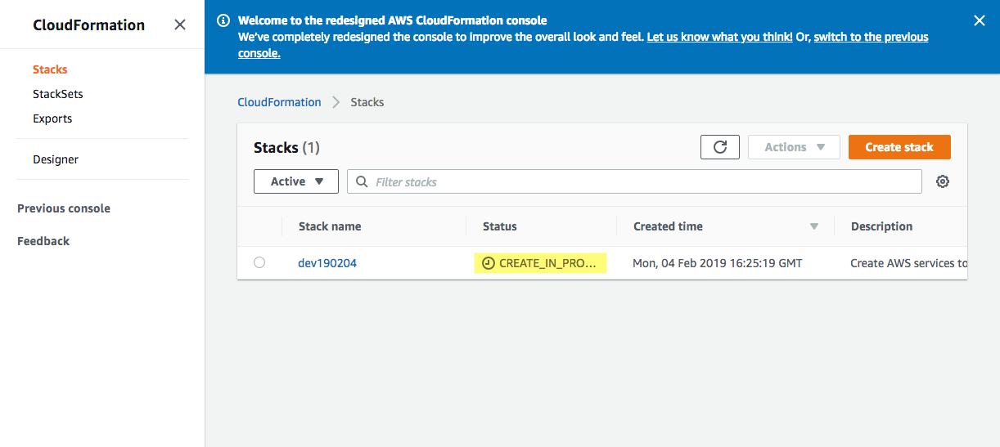

*   Go to CloudFormation Stacks left menu and wait until Status is **CREATE_COMPLETE**.
*   Click your newly created Stack name.
*   Once Stack status is CREATE_COMPLETE click **Outputs** tab.
*   You may want to copy and save on a secure place all Outputs, as you will use them for further configuration.

**Come back any time and open again the Outputs tab.** --> From AWS Console Home, search for CloudFormation.

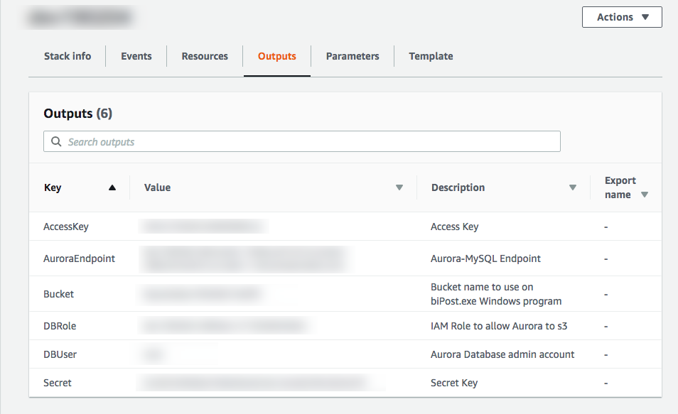

---

## Step 5: Add Role to Cluster

1.  Open [RDS console.](https://console.aws.amazon.com/rds/)
2.  Click **Databases** on left pane.
3.  Click DB identifier Role **Regional**.
4.  Scroll down to section **Manage IAM roles.**
    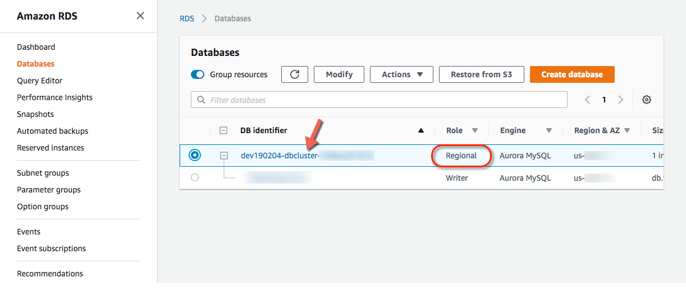
5.  Under **Add IAM roles to this cluster** select the DBRole created on Outputs tab, Step 4.5, and click **Add role** button.
    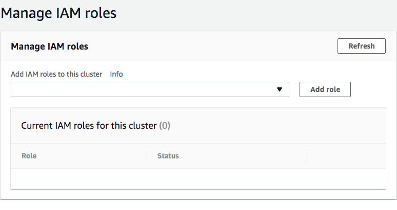
6.  Wait until you see Status **ACTIVE**.

---

## Step 6: Test MySQL Connection

1.  [Download MySQL Workbench](https://dev.mysql.com/downloads/workbench/) and install on your machine.
2.  Open MySQL Workbench and setup a new connection.
    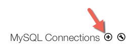
3.  Copy and paste from the **Outputs** tab (Step 4.5):
    > **Connection Name:** type any name of your preference.
    >
    > **Connection Method:** `Standard (TCP/IP)`
    >
    > **Hostname:** Paste the `AuroraEndpoint` string.
    >
    > **Port:** `3306`
    >
    > **Username:** Paste the `DBUser` string
    >
    > Click **Test Connection** and when prompt type the `DBAdminPassword` you used on Step 4.2.
    >
    > If you have a successful connection then you are good to go!

    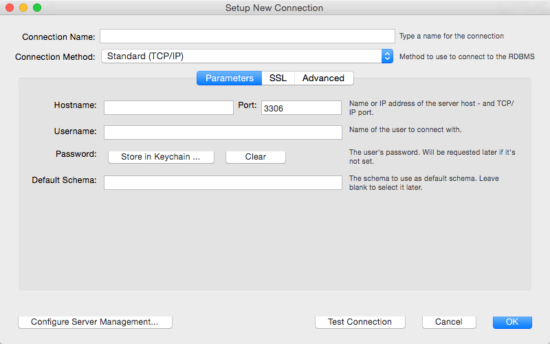

---

## Step 7: Register at Factor BI

Click and follow steps to [create your account with Factor BI.](/console)