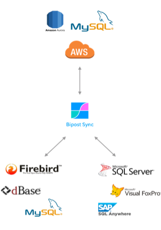
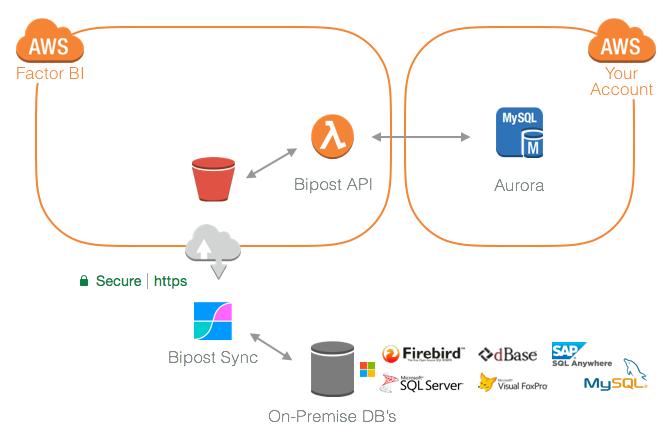

# Overview

Bipost is database synchronization & ETL tool for continually moving data from on-premises to AWS Aurora MySQL and back forth.

Created to keep your Windows databases on-premises while providing a way to extract, load & transform specific sets of data to AWS Aurora. Two-way synchronization lets you sync from AWS back to on-prem database. It is not intended to work as a replication engine or mirroring an entire database.

**Sources:**

*   [Firebird SQL](firebird)
*   [Microsoft SQL Server](sqlserver)
*   [MySQL](mysql)
*   [dBase](dbase)
*   [Visual FoxPro (VFP)](visualfoxpro)
*   [Sybase SQL Anywhere](sqlanywhere)

**Destination:**

*   <a href="https://aws.amazon.com/rds/aurora/details/mysql-details/" target="_blank">Amazon Aurora MySQL</a>

    > 

Deployed on AWS to scale at demand. Software as a Service (SaaS).

---

## Use Cases

*   Consolidate/merge information on AWS from across multiple locations and database engines, e.g. consolidate sales, inventory and financial information from several branches.
*   Build a Data Warehouse and make Analytics and Business Intelligence dashboards using <a href="https://marketingplatform.google.com/about/data-studio/" target="_blank">Google Data Studio</a> or <a href="https://aws.amazon.com/quicksight/" target="_blank">AWS QuickSight</a>, with native connection to Aurora-MySQL.
*   Make forecasts and statistical analysis with AWS services.
*   Extend your on-prem ERP & POS to AWS cloud and build web applications & back-end services.
*   Push data from AWS to on-prem systems.

---

## How it works

*   Bipost Sync reads table schema's and data and uploads it to AWS.
*   Database and tables are created/altered if they don't exist, and data is loaded to Aurora-MySQL.
*   Before and after data is loaded to Aurora-MySQL you can transform data with stored procedures.
*   Don't worry about sending the same data multiple times. Data is replaced using primary keys, avoiding duplicates.
*   Run manually or automatically with a Windows Task schedule.
*   Upload big datasets using Recursive Sync.

> Data is also available as CSV files on S3 so you can use other AWS services like <a href="https://aws.amazon.com/athena/" target="_blank">Amazon Athena</a> and <a href="https://aws.amazon.com/glue/" target="_blank">AWS Glue</a> to build your data lake.

### Two-way synchronization

*   Synchronize from Aurora-MySQL to on-premises SQL Server or Firebird SQL.
*   Customize data to download using [outData.json](synctowindows#outdatajson)
*   Insert/update the returned data to your on-prem DB.
*   Tables schemas are created/altered on your on-prem DB if they don't exist.
*   Primary keys set on Aurora-MySQL are used against on-prem DB to avoid duplicates.
*   Before and after data is loaded to on-prem DB you can transform data with stored procedures.
*   Only available for SQL Server and Firebird.
*   Learn more [here.](synctowindows)

---

## Private Cloud

We care deeply about privacy.

Our API links to your RDS instance on your AWS account, so you have full control and ownership of your databases.

Each RDS Aurora instance loads data by accessing a dedicated bucket, exclusive to your AWS account.

#### Architecture

<a href="https://aws.amazon.com/rds/aurora/" target="_blank">Aurora</a> is a MySQL compatible, fully managed database service built for the cloud with the performance and scalability of high-end commercial databases at 1/10th the cost.

---

## Start Using

*   30 days free.
*   Unlimited synchronizations.
*   No need to provide credit card information.

**[--> Start here](/easyawssetup)**

Or email us: [info@factorbi.com](mailto:info@factorbi.com)

---

## Prices

Pricing here: <a href="https://www.factorbi.com/database-synchronization" target="_blank">www.factorbi.com</a>

Firebird Community, <a href="https://www.firebirdsql.org/en/member-to-member-offers/" target="_blank">Members to Members Offer available.</a>

Members of <a href="https://aws-spanish.slack.com" target="_blank">Comunidad AWS en Español</a>, ask for special deal.

---

## On The Media

<a href="https://medium.com/@jaiment/a-journey-from-on-premises-to-cloud-business-intelligence-12a1eedcd191" target="_blank">A journey from on-premises to Cloud Business Intelligence</a>

> <a href="https://medium.com/@jaiment/a-journey-from-on-premises-to-cloud-business-intelligence-12a1eedcd191" target="_blank">
> 
</a>

<a href="https://medium.com/@jaiment/why-we-dropped-microsoft-power-bi-and-embraced-aws-quicksight-a64fb0816ead" target="_blank">Why we dropped Microsoft Power BI and embraced AWS QuickSight</a>

> <a href="https://medium.com/@jaiment/why-we-dropped-microsoft-power-bi-and-embraced-aws-quicksight-a64fb0816ead" target="_blank">
> 
</a>

<a href="https://youtu.be/dprtSTSbCEE?t=10m41s" target="_blank">At AWS re:Invent 2017</a>

> <a href="https://youtu.be/dprtSTSbCEE?t=10m41s" target="_blank">
> 
</a>

---

## Release Notes

#### 1.4.3 (GA) 2019-03-12

*   Sybase SQL Anywhere connection (release candidate).
*   Firebird 3.0 compatibility.
*   Bug fixes.

#### 1.3.0 (GA) 2019-01-29

*   Tenant: Sync several on-premise databases to a single MySQL database and differentiate them with tenant_id. Great for consolidation. Learn more [here.](firebird#tenant)
*   Synchronize views and tables without a primary key using [customSchema.json](customdatajson#customschemajson)
*   Greater support for SQL Server data types.
*   Bug fixes.

#### 1.2.2 (GA) 2018-10-31

*   MySQL on-prem connection added.
*   Bug fixes.

#### 1.1.5 (GA) 2018-10-07

*   Visual FoxPro on-prem connection added.
*   Define primary keys for DBF files using `customSchema.json`
*   Added `bipost_system` database on Aurora for detailed sync information.
*   Read list of tables and comments from `bipost_system` before data is loaded to Aurora. Useful for consolidation scenarios where different on-prem databases all point to the same DB on Aurora.
*   Bipost Sync now display some error log messages after data is uploaded to AWS.

#### 1.1.0 (GA) 2018-08-12

*   DBF dBase III on-prem connection added.
*   Run unlimited time stored procedures after data is uploaded to Aurora.
*   Improved security for two-way synchronization.
*   Improved support for special characters, e.g. now able to sync XML documents inside BLOB (Firebird) and TEXT (SQL Server) fields.
*   First time customers: Automated creation of AWS services via [CloudFormation template.](easyawssetup#step-4-cloudformation)
*   Bug fixes.

#### 1.0.0 (General Availability) 2018-03-02

*   Data upload is now done through secure HTTPS.
*   JOIN parameter now supported for Firebird SQL.
*   Recursive sync now supported for Firebird SQL.
*   Connection information now encrypted.
*   Bug fixes.

#### 0.5.6 (Beta) 2017-12-02

*   Bidirectional syncing is here!
*   Synchronize to any AWS Region.
*   Performance improvements to API, now able to load nearly 1.5 million rows (or 280 MB uncompressed files) on a single call.
*   Firebird transaction READ UNCOMMITTED to prevent Bipost Sync from being stopped while other transactions are still not committed.
*   Initial and final statements on Aurora are disabled on recursive sync.
*   Bug fixes.

#### 0.4.2 (Beta) 2017-09-16

*   Table schemas are now synchronized against source definition on every sync, details [here.](bipostapi#create-alter-schemas)
*   Bug fixes.

#### 0.4.0 (Beta) 2017-08-20

*   Custom connections added.
*   Initial statement added to API.

---

## Contact Us

We are always happy to hear about you.

*   Email: [info@factorbi.com](mailto:info@factorbi.com)
*   Company page:
    > 🇺🇸 English: <a href="https://www.factorbi.com/" target="_blank">www.factorbi.com</a>
    > 🇲🇽 Español: <a href="https://www.factorbi.com/?lang=es" target="_blank">www.factorbi.com</a>