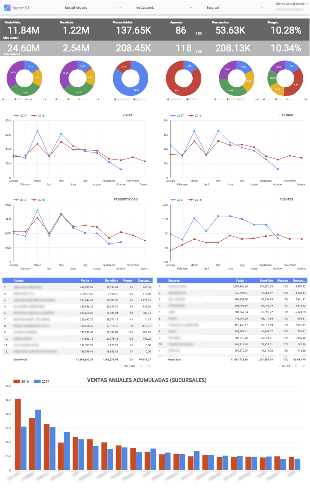

## Intelisis ERP

Integramos Intelisis con Amazon Web Services para crear tableros de mando, realizar análisis contable y fiscal y desarrollar soluciones Web a la medida.

Buscas un Business Intelligence sin pagar licencias por usuario? Visitanos! [www.factorbi.com](https://www.factorbi.com/intelisis?lang=es)

Google Data Studio es una excelente alternativa vs Qlik View, Power BI y Cognos BI.

Escríbemos y te ayudamos! [info@factorbi.com](mailto:info@factorbi.com)

---

## Demo

[Tablero de Mando Ventas Intelisis](https://datastudio.google.com/u/0/reporting/1Wc_z1fHWvXSxS5hd5VO4MkfbVilUsKMZ)

---

## Contacto

¿Necesitas ayuda? Escríbemos! [info@factorbi.com](mailto:info@factorbi.com)