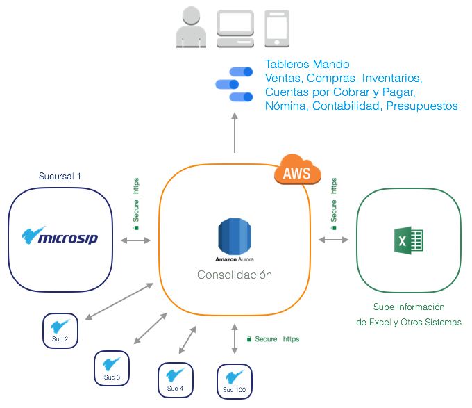
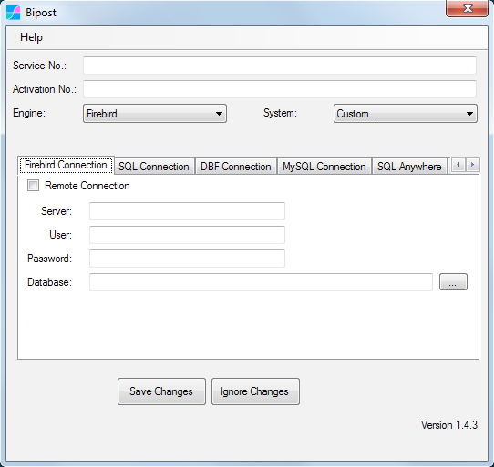
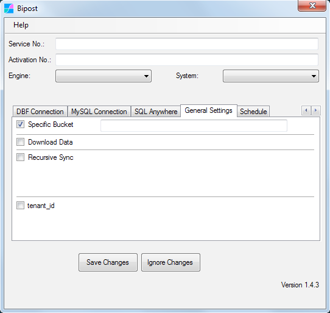
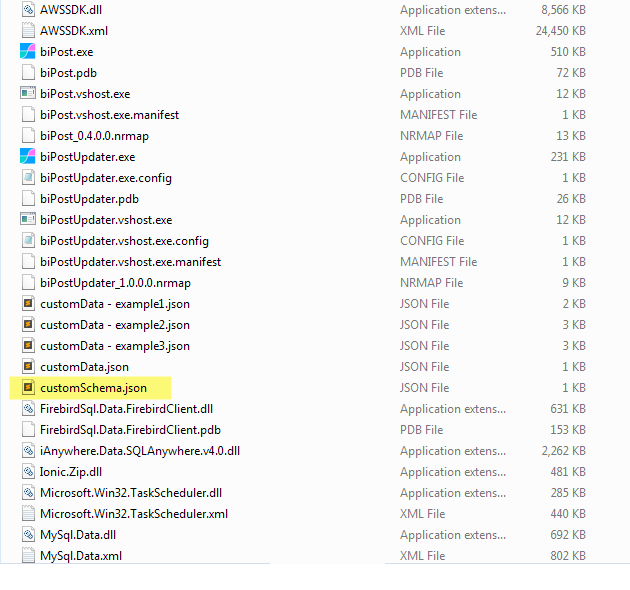
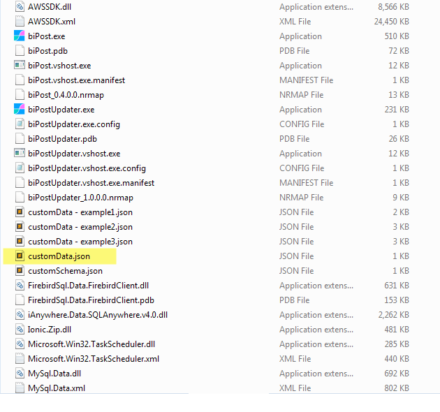
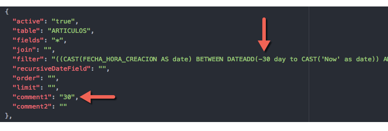
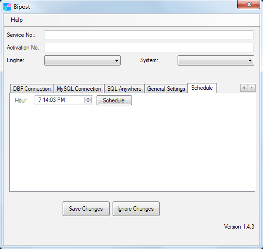
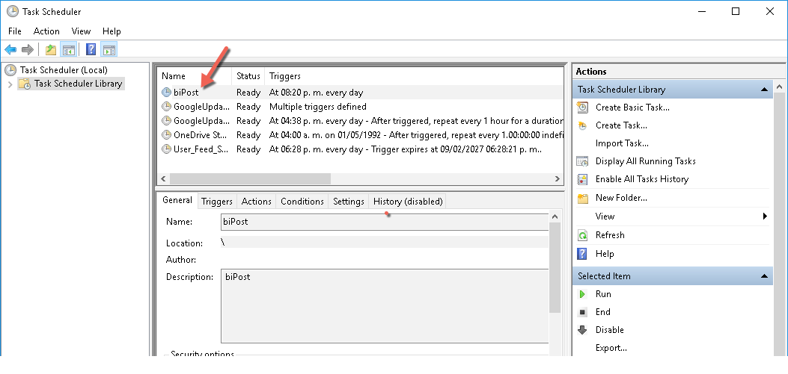
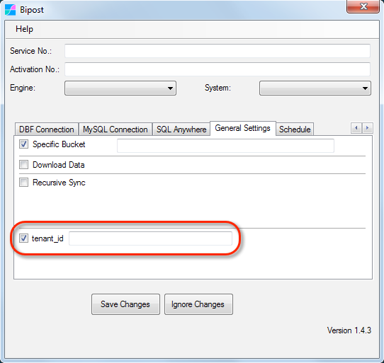

## Microsip ERP


Integramos Microsip ERP con Amazon Web Services para crear tableros de mando, realizar análisis contable y fiscal y desarrollar soluciones a la medida.

Consolidamos también información de distintas sucursales que utilizan bases de datos separadas de Microsip, de razones sociales distintas y de la misma razón social (cuando no usas Replix).

Buscas un Business Intelligence? Visitanos! <a href="https://www.factorbi.com/microsip?lang=es" target="_blank">www.factorbi.com</a>

Escríbemos y te ayudamos en lo que necesitas: [info@factorbi.com](mailto:info@factorbi.com)

---

## Casos de Uso

*   Dashboards Punto de Venta, Ventas, Pedidos, Cotizaciones, Remisiones.
*   Flujo de Efectivo + Cuentas por Cobrar + Cuentas por Pagar.
*   Estados Financieros Gráficos.
*   Consolidación de Empresas y Sucursales.
*   Contabilidad Avanzada.
*   Origen y Aplicación de Recursos.
*   Tableros Compras e Inventarios.

<a href="https://www.factorbi.com/microsip?lang=es" target="_blank">**Ver casos aquí.**</a>

---

## Demo Business Intelligence

<a href="https://datastudio.google.com/reporting/1oMPdxgX1Gh-CQMRoTnxQct6j2rgycVnL" target="_blank">Tablero de Mando Ventas Microsip</a>

<a href="https://datastudio.google.com/reporting/1oMPdxgX1Gh-CQMRoTnxQct6j2rgycVnL" target="_blank">

</a>

<a href="https://datastudio.google.com/reporting/1oMPdxgX1Gh-CQMRoTnxQct6j2rgycVnL/page/UePF" target="_blank">

</a>

---

## Consolidación

Consolida información de Microsip de distintas razones sociales y sucursales que utilizan bases de datos independientes. Sube información de Excel como metas de ventas y presupuestos para realizar un análisis completo.



---

## Excel Tablas Microsip

<a href="http://bit.ly/tablas_microsip" target="_blank"></a> Abre aquí <a href="http://bit.ly/tablas_microsip" target="_blank">Excel tablas Microsip.</a>

**NOTA:** La lista del link anterior puede no estar completa.

Para obtener el listado completo de tablas de acuerdo a tu base de datos, puedes usar el siguiente query en Firebird:

```sql
select rdb$relation_name
from rdb$relations
where rdb$view_blr is null
and (rdb$system_flag is null or rdb$system_flag = 0)
order by rdb$relation_name;
```

---

## Descarga el Programa de Sincronización

1.  <a href="https://s3.amazonaws.com/factorbi/bipost/biPost.zip" target="_blank">**Descarga aquí.**</a>
2.  En tu servidor de Firebird crea una carpeta, por ejemplo **C:\Bipost\** y copia los archivos.

---

## Configura la Sincronización

La siguiente información es para Distribuidores Certificados de Factor BI.

Si eres usuario de Microsip por favor envíanos un correo y nos pondremos en contacto: [info@factorbi.com](mailto:info@factorbi.com)

#### 1. Llaves de sincronización

Entra a la <a href="https://s3.amazonaws.com/biforms-prod/index.html" target="_blank">Consola Factor BI</a> y en el menú **Service Numbers** copia **Service No.** y **Activation No.** que correspondan con la base de datos a sincronizar.

#### 2. Configura biPost

Abre biPost.exe y oprime **Configuration**.



*   **Service No.:** Pega el texto que obtuviste de la consola.
*   **Activation No.:** Pega el texto que obtuviste de la consola.
*   **Engine:** <span style="color:red">`Firebird`</span>
*   **System:** <span style="color:red">`Custom...`</span> <-- IMPORTANTE usar este valor.

| Pestaña Firebird Connection |                                                                      |                                                                                    |
| --------------------------- | -------------------------------------------------------------------- | ---------------------------------------------------------------------------------- |
| Remote Connection           | *Apagado*                                                            | *Activar SOLAMENTE cuando biPost.exe no está en el servidor de Firebird*         |
| Server                      | *En blanco*                                                          | *Usar SOLAMENTE cuando Remote Connection está activado. Ingresar IP o nombre de red de la PC donde está el servidor Firebird.* |
| User                        | *Usuario Firebird*                                                   | *Por lo regular SYSDBA*                                                            |
| Password                    | *Contraseña del usuario*                                             |                                                                                    |
| Database                    | *Ruta archivo FDB*                                                   | *Comúnmente C:\Datos Microsip*                                                     |

#### 3. Pestaña General Settings



*   Activa **Specific Bucket**.
*   Ingresa el texto que recibiste por email de Factor BI.

Oprime **Save Changes**.

---

## Descarga Archivos de Sincronización

1.  <a href="https://s3.amazonaws.com/factorbi/microsip/customData-Microsip.zip" target="_blank">Descarga aquí.</a>
2.  Para visualizar correctamente los archivos recomendamos utilizar <a href="https://www.sublimetext.com/" target="_blank">Sublime Text.</a>
3.  Para validar un archivo JSON que modifiques, utiliza <a href="https://jsonlint.com/" target="_blank">JSONLint.</a>

---

## Sincronización Primera Vez

1.  Descomprime customData-Microsip.zip
2.  Reemplaza el archivo **customSchema.json** en tu carpeta Bipost.
    
3.  Abre **customData-catalogos.json** del ZIP copia y pega el contenido en **customData.json**
    
4.  Abre biPost.exe y sincroniza con el botón **Sync Now**. Este proceso puede durar algunos minutos. Recibirás el mensaje **Sync Completed** cuando termine.
5.  Repite los pasos 3 y 4 para los archivos (respetando el orden mostrado):
    *   customData-movimientos_CM_IN.json
    *   customData-movimientos_CO_NO.json
    *   customData-movimientos_PV.json
    *   customData-movimientos_VE.json
    *   customData-movimientos_BA_CC_CP.json
    *   customData-30dias.json
6.  Agenda la sincronización diaria, ver siguiente sección 👇

---

## Agenda

**NOTA:** Este proceso se realiza después de sincronizar por primera vez la base de datos.

1.  Abre la carpeta donde colocaste Bipost, usualmente C:\Bipost.
2.  Abre el archivo **customData.json** y verifica que el contenido es para sincronizar 30 días. Esto se puede ver rápidamente en alguna tabla como "ARTICULOS", ejemplo:
    
3.  Abre biPost.exe en la pestaña **Schedule**
    
    Oprime **Configuration**, establece el horario para sincronizar y oprime **Schedule**. Oprime **Save Changes**.
    Se sugiere usar un horario después que la empresa termine sus operaciones, por ejemplo en la madrugada.
    Lo anterior crea una tarea en el **Programador de Tareas** de Windows. Si requieres sincronizar más de una vez al día, ve al menú de Windows y abre "Programador de Tareas".
    Seleccionar la primer carpeta del lado izquierdo y dar doble click a la tarea **biPost**.
    
    En la pestaña **Desencadenadores** puedes crear más horarios: Nuevo \ Diariamente \ Inicio: establecer fecha y horario nuevo.

---

## Tenant

Si vas a consolidar múltiples bases de datos de Microsip, por favor comunícate con nosotros para explicar el uso correcto de la opción **tenant_id**.



---

## Contacto

¿Necesitas ayuda? Escríbemos! [info@factorbi.com](mailto:info@factorbi.com)