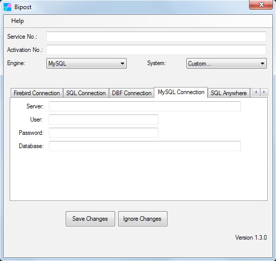

## Synchronize MySQL on-prem to AWS

Continually export MySQL On-Premises data to AWS Aurora MySQL.

*   Great to consolidate/merge information on the cloud from multiple locations that use MySQL databases, then build your own Data Warehouse and deliver Business Intelligence.
*   On top of AWS build web applications using data pulled from on-prem MySQL.

---

## Before You Begin

*   Have your AWS account linked it to our API. Not sure? [follow here.](/easyawssetup)
*   Complete registration on [Factor BI console](/console)
*   Create Service and Activation keys and configure service, [--> details here.](/console#configure-your-first-service)
*   [Download Bipost Sync](/installation) program for Windows.

---

## Bipost Sync

*   **Service No.:** 36 digit number, it may look like this: `a1bcd23e-4fa5-67b8-cd9e-f0123abc4567`
*   **Activation No.:** 24 digit number, it may look like this: `5990ab12c3de45f6a78bc90d`
*   **Engine:** `MySQL`
*   **System:** `Custom...`

| MySQL Connection |             |
| ---------------- | ----------- |
| Server           | *Host name* |
| User             |             |
| Password         |             |
| Database         |             |

---

## General Settings

### Specific Bucket:

*   Enter your **Bucket Name**. It may look like this: `bipostdata-acb123456789012`
*   It is available on your AWS Account \ CloudFormation Stack.

> 

### Download Data

*   Leave **unchecked**.

### Recursive Sync

*   Use only to upload historic data. It optimizes upload by extracting and uploading one day at a time for a given date range.
*   Always use along with [customData.json](/customdatajson) so you can configure the date field to use for each table.
*   **NOTE:** For daily sync, instead of using Recursive Sync, dynamically parse a date range into customData.json ==> <a href="https://github.com/factorbi/bi-intelisis/blob/master/customData-examples.json" target="_blank">Examples here.</a>
*   More info about this feature see [Recursive Synchronization](/customdatajson#recursive-synchronization)

## Tenant

*   This allows to sync several on-premise databases to a single Aurora-MySQL database and differentiate them with **tenant_id**. Great for consolidation!
*   Activate and type a string to add a fixed column to every table that is synced.
*   This fixed column will be included in the PRIMARY KEY on Aurora-MySQL.

---

## Tables to Sync

**IMPORTANT:** Tables and subsets of data to synchronize are specified in **customData.json** file ==> [follow here.](/customdatajson)

---

## Schedule

If you want automated execution of Bipost Sync, then set the **Hour** desired and click **Schedule**.

This will create a Windows Task that will run daily. If you want a different schedule, then open **Windows Task Scheduler** as follows.

Control Panel \ Administrative Tools:

If you manually create a task to run biPost then use `argument: post`

---

## Check for Updates

New versions of Bipost Sync can be checked using **Help \ Check for Updates.**

---

## Sync multiple databases

If you are going to synchronize two or more databases from the same Windows host, create separate Bipost Sync folders for each database. Then customize each folder with the desired data set as explained [here.](/customdatajson)

---

## Contact

Questions? Send us an email: [info@factorbi.com](mailto:info@factorbi.com)