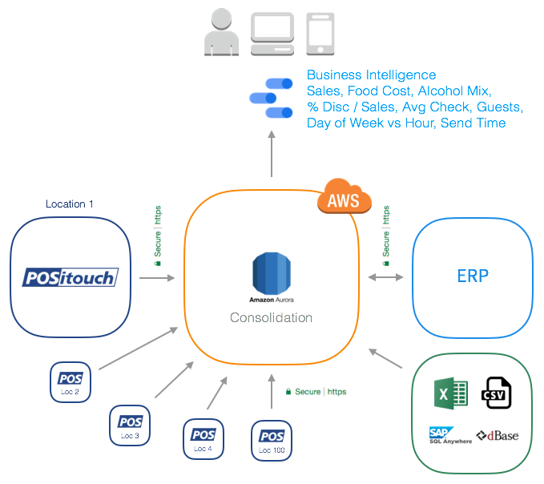
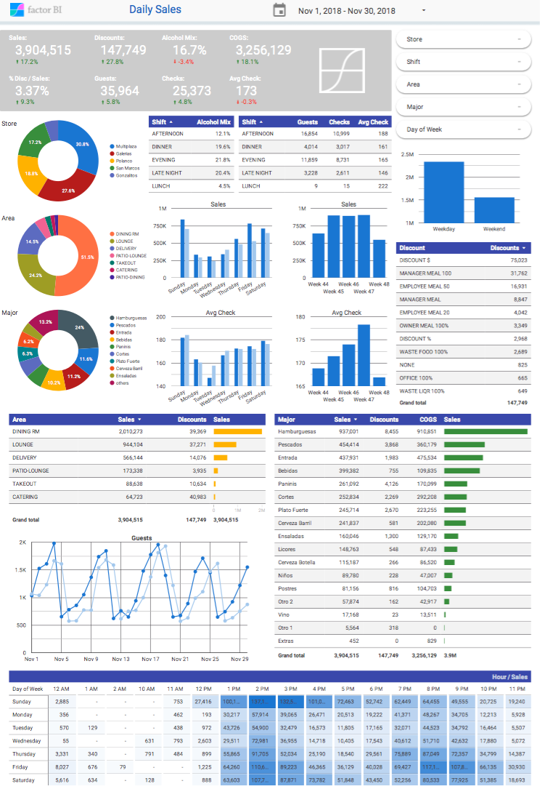
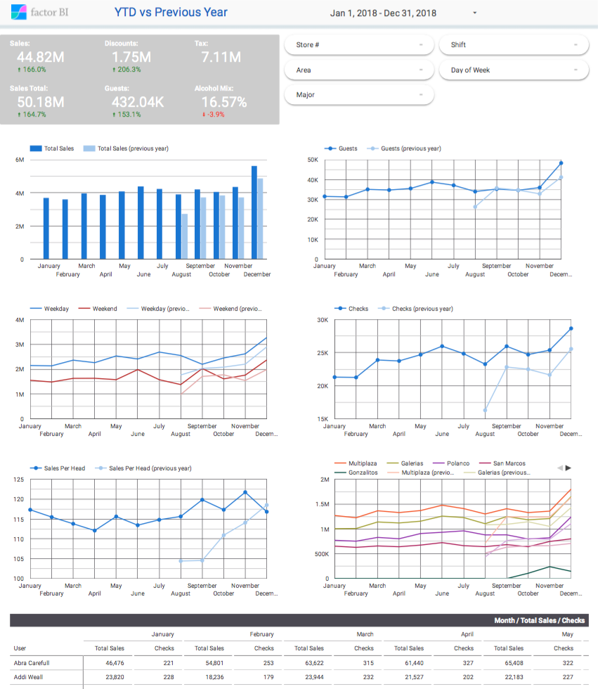
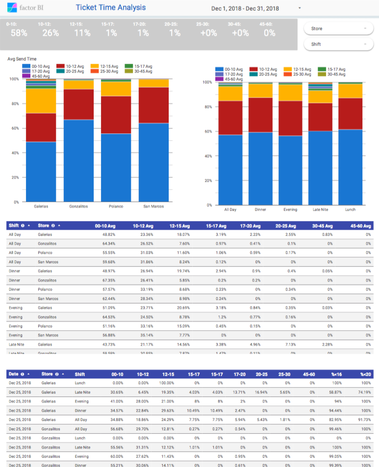

## POSitouch Restaurant Point of Sale

Connect POSitouch restaurant POS to Amazon Web Services and analyze Sales, Alcohol Mix, Food Cost, Ticket Time and Time and Attendance information from across multiple restaurant locations.

We have the full solution for:

*   Automatically export daily information from each restaurant location.
*   Automatically merge, apply consolidation rules and create summaries on AWS.
*   Calculate KPI's: Alcohol Mix, COGS, % Disc / Sales, Avg Check, Guests, Day of Week vs Hour, Send Time, etc.
*   Deliver Cloud Business Intelligence Dashboards with Google Data Studio, a FREE B.I. tool from Google.
*   Upload & merge information from other POS systems like Micros or sources like Excel spread sheets and ERP's.
*   Send daily email reports with PDF attachments.

Contact us: [info@factorbi.com](mailto:info@factorbi.com)

[www.factorbi.com](https://www.factorbi.com/restaurants)

---

## Business Intelligence Demo

[POSitouch Business Intelligence Demo](https://datastudio.google.com/reporting/10DcPMQ3tHwrsny2R4GXwNP-AsRCTjBJp/)

---

# POSitouch Manuals and Resources

*   [POSitouch DBF database structure & documentation download.](https://s3.amazonaws.com/factorbi/POSIDBF2.PDF)
*   [POSitouch Inventory Control and Food Cost Manual with Inventory Reports.](https://s3.amazonaws.com/factorbi/POSitouch+Inventory+Control+and+Food+Cost+Manual+with+Inventory+Reports.pdf)
*   [POSitouch Time and Attendance User Manual.](https://s3.amazonaws.com/factorbi/POSitouch+Time+and+Attendance+User+Manual.pdf)

---

## Contact Us

*   Company page: [www.factorbi.com](https://www.factorbi.com/restaurants)
*   Email: [info@factorbi.com](mailto:info@factorbi.com)