## Link your AWS Account

**These instructions are for experienced AWS administrators only.**

**Follow these instructions only if you want to manually link your AWS Account to Bipost API. Strong knowledge of AWS is required.** We strongly recommend to use instead the automated [CloudFormation template](/easyawssetup#step-4-cloudformation).

IMPORTANT NOTICE: If you are planning to use the following AWS resources for production you may want to follow your company policies and understand how to use AWS security according to your needs.

---

## Canonical User ID

Sign in with the **root** AWS account.

1.  Upper right corner of your AWS console, click your account name (or follow next link).
2.  <a href="https://console.aws.amazon.com/iam/home#/security_credential" target="_blank">My Security Credentials.</a>
3.  Click *Continue to Security Credentials* if dialog appears.
4.  Expand Account Identifiers.
5.  Copy AWS Account ID (12-digit) and Canonical User ID (64-digit).
    
6.  Email these numbers to [info@factorbi.com](mailto:info@factorbi.com) so we can setup your dedicated Bucket.

**Stop here until you get a reply email from Factor BI.** We will provide your **bucket name** which will be used on further steps.

---

## IAM Policy to Grant Access to S3

<a href="https://console.aws.amazon.com/iam/home?#home" target="_blank">IAM Console.</a>
2.  In the left navigation pane choose **Policies.**
3.  **Create policy** blue button.
4.  Click **JSON** tab.
    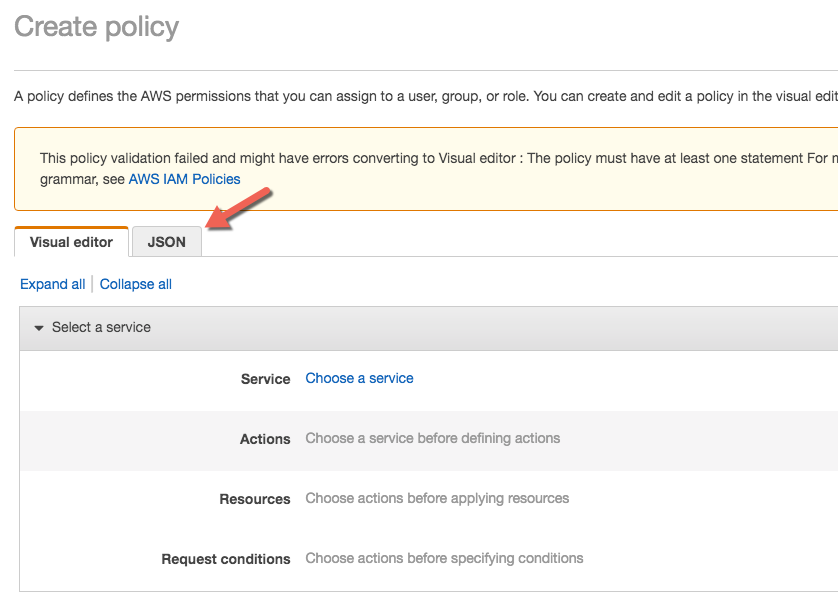
5.  Copy and paste the following.
    ```json
    {
        "Version": "2012-10-17",
        "Statement": [
            {
                "Effect": "Allow",
                "Action": "s3:*",
                "Resource": [
                    "arn:aws:s3:::bipostdata-abc123456789012",
                    "arn:aws:s3:::bipostdata-abc123456789012/*"
                ]
            },
            {
                "Effect": "Allow",
                "Action": "lambda:InvokeFunction",
                "Resource": "arn:aws:lambda:us-east-1:951464950892:function:bipost-getOutData"
            }
        ]
    }
    ```
6.  Replace the text <span style="color:red">`bipostdata-abc123456789012`</span> with the Bucket Name you received from us over email.
7.  Click **Review policy** blue button on the lower right.
8.  Enter the following on the Review policy screen.
    > Name: <span style="color:red">`auroraToS3Policy`</span>
    >
    > Name: <span style="color:red">`Connection to Factor BI bucket`</span>
9.  Click **Create policy** blue button.

Further information from AWS go to: <a href="https://docs.aws.amazon.com/AmazonRDS/latest/UserGuide/AuroraMySQL.Integrating.Authorizing.IAM.S3CreatePolicy.html" target="_blank">Allowing Amazon Aurora to Access Amazon S3 Resources</a>

---

## IAM Role to Load Data From S3

1.  Open <a href="https://console.aws.amazon.com/iam/home?#home" target="_blank">IAM Console.</a>
2.  In the left navigation pane choose **Roles.**
3.  **Create role** blue button.
4.  Choose **AWS service,** then **RDS**
    > 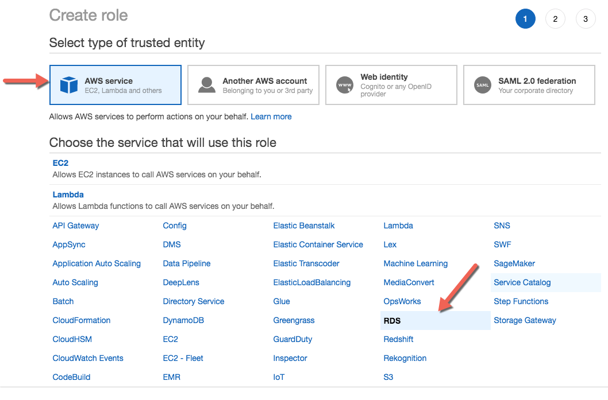
5.  Under **Select your use case** click **RDS - CloudHSM and Directory Service,** click **Next: Permissions** blue button.
6.  Click **Next: Tags** and then **Next: Review**.
7.  Set **Role name:** <span style="color:red">`RDSLoadFromS3`</span> and click **Create role.**
8.  Now from the navigation details, click the role you just created.
    > 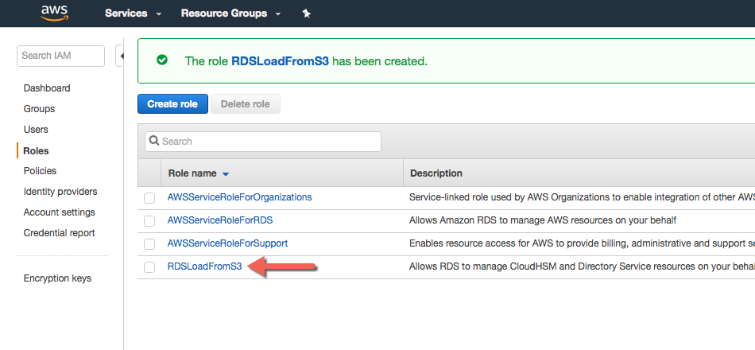
9.  Under permissions tab, detach by clicking **X** the following:
    > AmazonRDSDirectoryServiceAccess
    >
    > RDSCloudHsmAuthorizationRole
    >
    > 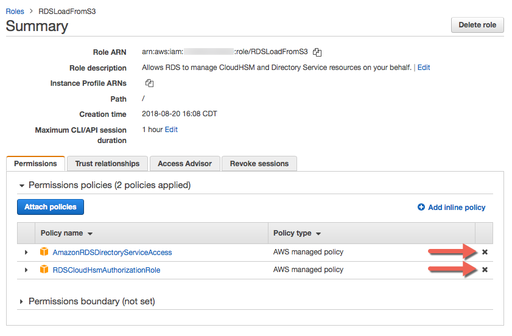
10. Now click **Attach policies** blue button.
    > 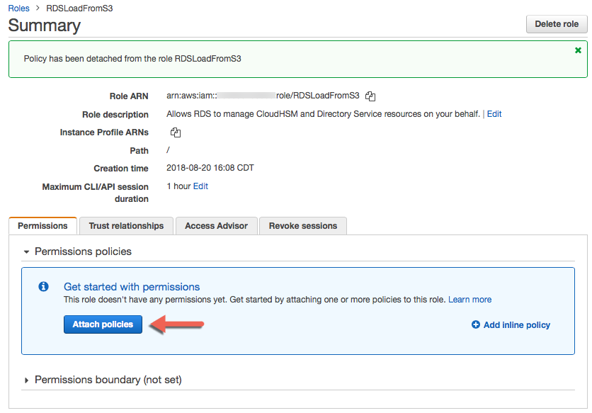
11. Filter policies by Customer managed.
    > 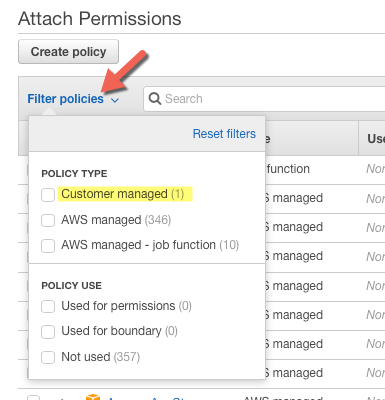
12. Select <span style="color:red">`auroraToS3Policy`</span> and click **Attach policy** blue button.
13. Copy **Role ARN** string and save it for further use. It may look like this: <span style="color:red">`arn:aws:iam::123456789012:role/RDSLoadFromS3`</span>

Further information from AWS go to: <a href="https://docs.aws.amazon.com/AmazonRDS/latest/UserGuide/AuroraMySQL.Integrating.Authorizing.IAM.CreateRole.html" target="_blank">Creating an IAM Role to Allow Amazon Aurora to Access AWS Services</a>

---

## IAM User to Save Data to S3

This step will provide access to files created by the <span style="color:red">`SELECT INTO OUTFILE S3`</span> command.

1.  Open <a href="https://console.aws.amazon.com/iam/home#/users" target="_blank">IAM console.</a>
2.  In the left navigation pane choose **Users.**
3.  Click **Add user** blue button, upper left corner.
4.  User name: <span style="color:red">`auroraToS3`</span>
5.  Access type: **Programmatic access**
6.  Click **Next: Permissions** blue button lower right corner.
7.  Select **Attach existing policies directly**
8.  Filter policies by Customer managed.
    > 
9.  Select **auroraToS3Policy**
    > 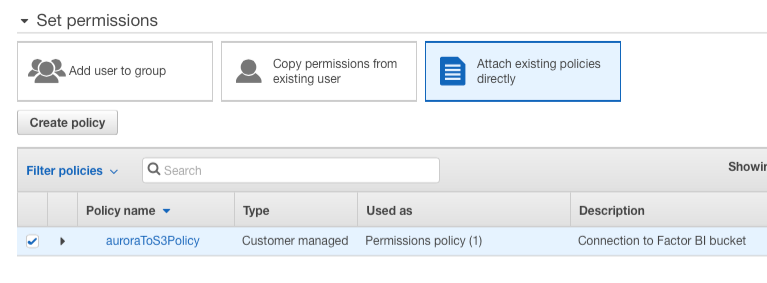
10. Click **Next: Tags** and then **Next: Review**.
    > 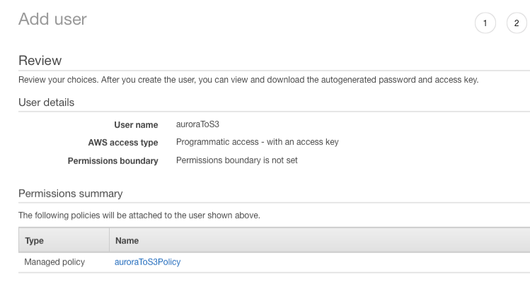
11. Click **Create user** blue button lower right corner.
12. Click **Download .csv**.
13. Email the CSV to [info@factorbi.com](mailto:info@factorbi.com) so we can setup the Access key.
    > 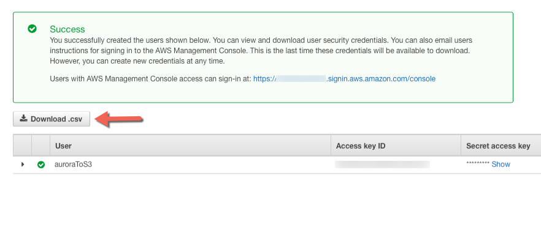

---

## Closest AWS Region

1.  Click the following image and hit **HTTP Ping** and look for the lowest latency.
    > **<a href="http://cloudping.info" target="_blank"></a>**
2.  Try several times and at different times of the day.
3.  Login to your <a href="https://console.aws.amazon.com/console/home" target="_blank">AWS Account Console Home</a> and select the closest region to your location.
    > 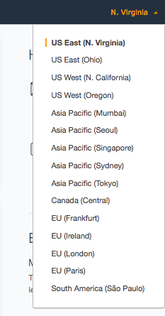

---

## Cluster Parameter Group

<a href="https://console.aws.amazon.com/rds/" target="_blank">RDS console.</a>
2.  On left pane go to **Parameter groups.**
3.  Click **Create parameter group** orange button on top.
    > Parameter group family: <span style="color:red">`aurora-mysql5.7`</span>
    >
    > Type: <span style="color:red">`DB Cluster Parameter Group`</span>
    >
    > Group name: <span style="color:red">`ClusterAllowAWSAccess`</span>
    >
    > Description: <span style="color:red">`Bipost Aurora Database Cluster Parameter Group`</span>
4.  Click **Create** orange button and refresh browser.
5.  Click check box on your new <span style="color:red">`clusterallowawsaccess`</span> parameter group and click **Parameter group actions** and then **Edit.**
6.  Make sure you have your ARN role string [not sure? click here](/setupaws#iam-role-to-load-data-from-s3) and replace it below.
7.  Set the following:
    | Name                       | Values                                       | Example                                          |
    | -------------------------- | -------------------------------------------- | ------------------------------------------------ |
    | aurora_load_from_s3_role   | paste [Role ARN string](/setupaws#iam-role-to-load-data-from-s3) | <span style="color:red">`arn:aws:iam::123456789012:role/RDSLoadFromS3`</span> |
    | aurora_select_into_s3_role | paste Role ARN string                        | <span style="color:red">`arn:aws:iam::123456789012:role/RDSLoadFromS3`</span> |
    | aws_default_lambda_role    | paste Role ARN string                        | <span style="color:red">`arn:aws:iam::123456789012:role/RDSLoadFromS3`</span> |
    | aws_default_s3_role        | paste Role ARN string                        | <span style="color:red">`arn:aws:iam::123456789012:role/RDSLoadFromS3`</span> |
8.  Click **Save changes** orange button.
9.  Click **Preview changes** and it should look like this:
    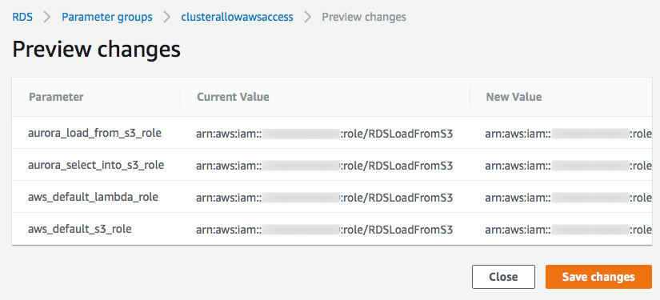

Further information from AWS go to: [Associating an IAM Role with a DB Cluster](https://docs.aws.amazon.com/AmazonRDS/latest/UserGuide/AuroraMySQL.Integrating.Authorizing.IAM.AddRoleToDBCluster.html)

---

## DB Parameter Group

1.  Go to [RDS console.](https://console.aws.amazon.com/rds/)
2.  On left pane go to **Parameter groups.**
3.  Click **Create parameter group** orange button on top.
    > Parameter group family: <span style="color:red">`aurora-mysql5.7`</span>
    >
    > Type: <span style="color:red">`DB Parameter Group`</span>
    >
    > Group name: <span style="color:red">`InstanceAllowAWSAccess`</span>
    >
    > Description: <span style="color:red">`Bipost Aurora Parameter Group`</span>
4.  Click **Create** orange button and refresh browser.
5.  Click check box on your new <span style="color:red">`instanceallowawsaccess`</span> parameter group and click **Parameter group actions** and then **Edit.**
6.  Set the following:
    | Name                            | Values     |
    | ------------------------------- | ---------- |
    | log_bin_trust_function_creators | 1          |
    | max_allowed_packet              | 1073741824 |
    | max_connections                 | 16000      |
    | max_user_connections            | 4294967295 |
    | event_scheduler                 | ON         |
7.  Click **Save changes** orange button.
8.  Click **Preview changes** and it should look like this:
    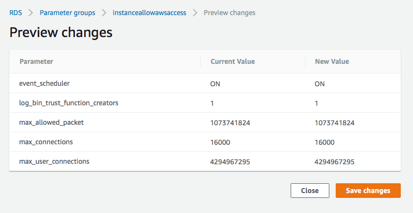

---

## Aurora Instance

#### Create Instance

1.  Go to **RDS Console** and click Databases.
2.  Click **Create database**, orange button.
3.  Select Engine: **Amazon Aurora**, scroll down, Edition: **MySQL 5.7-compatible** click **Next** orange button.
4.  Specify DB details
    > | Parameter               | Set to:                                                    |
    > | ----------------------- | ---------------------------------------------------------- |
    > | Capacity type           | Provisioned                                                |
    > | DB engine version       | Aurora (MySQL)-5.7.12                                      |
    > | DB instance class       | db.t2.small                                                |
    > | Multi-AZ deployment     | No                                                         |
    > | DB instance identifier  | Set a lower-case name with no special characters         |
    > | Master username         | root                                                       |
    > | Master password         | Combine upper and lower case, numbers and special characters. |
5.  Click **Next** orange button.
6.  Configure advanced settings
    > | Parameter                   | Set to:                       |
    > | --------------------------- | ----------------------------- |
    > | Virtual Private Cloud (VPC) | Create new VPC                |
    > | Subnet group                | Create new DB Subnet Group    |
    > | Public accessibility        | Yes                           |
    > | Availability zone           | No preference                 |
    > | VPC security groups         | Create new VPC security group |
    > | DB cluster identifier       | *leave blank*                 |
    > | Database name               | *leave blank*                 |
    > | Port                        | 3306                          |
    > | DB parameter group          | instanceallowawsaccess        |
    > | DB cluster parameter group  | clusterallowawsaccess         |
    > | Option group                | *leave default*               |
    > | Encryption                  | Disable encryption            |
    > | Failover Priority           | tier-0                        |
    > | Backup retention period     | 1 day                         |
    > | Monitoring                  | Disable enhanced monitoring   |
    > | Log exports                 | All unchecked                 |
    > | Auto minor version upgrade  | Enable auto minor version upgrade |
    > | Maintenance windows         | *leave defaults*              |
    > | Enable deletion protection  | Clear check box               |
7.  Click **Create database** orange button. This process may take a few minutes.

---

## RDS Instance Security Group

1.  Go to **RDS Console** and click Databases.
2.  Once the new instance (Writer Role) has **Status:** <span style="color:red">`Available`</span> proceed:
3.  Click your new instance (Writer Role).
4.  **Connectivity** tab.
5.  Under **Security** click the blue string that looks like this
    > <span style="color:red">`rds-launch-wizard (sg-XXXXXXXX)`</span>
    >
    > 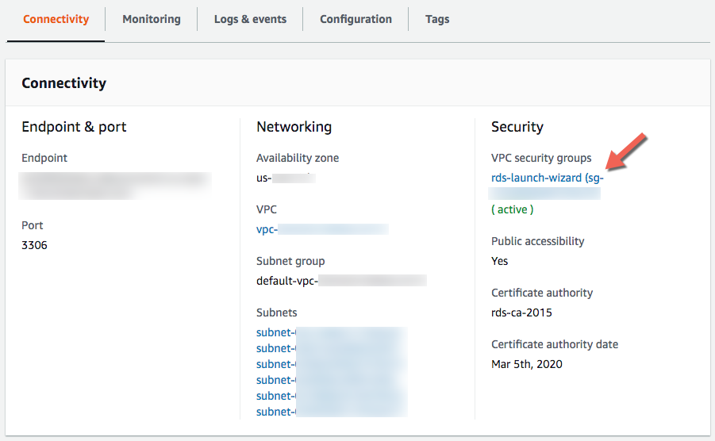
6.  You are now on EC2 Management Console and Security Group ID is already selected.
7.  Click **Actions \ Edit inbound rules**
8.  Remove the default Custom TCP rule created.
9.  Click **Add Rule**, under Type select <span style="color:red">`MYSQL/Aurora`</span>
10. Source **Custom** and enter this value: <span style="color:red">`0.0.0.0/0`</span>
11. Repeat steps 9 & 10 and enter this value <span style="color:red">`::/0`</span>
    > 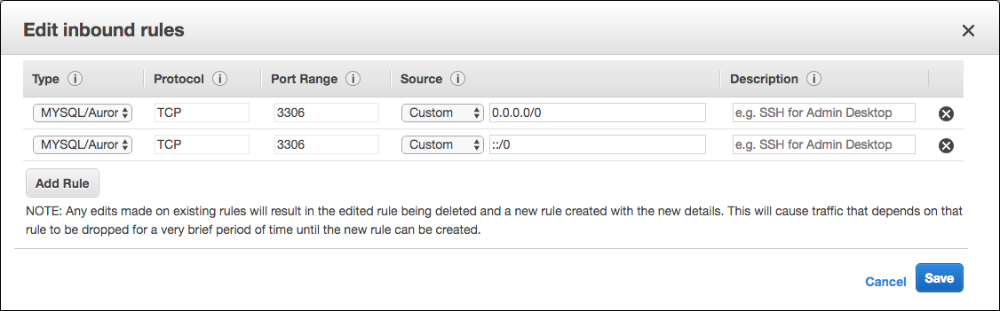
12. Click **Save** blue button.
13. Click **Actions \ Edit outbound rules**
14. Verify if Type: <span style="color:red">`All traffic`</span>, Destination: <span style="color:red">`Custom`</span> and value: <span style="color:red">`0.0.0.0/0`</span> is already set, if not, add the rule.
<a href="https://console.aws.amazon.com/rds/" target="_blank">RDS console</a>
16. Wait until **Status** is <span style="color:red">`Available`</span>
    > 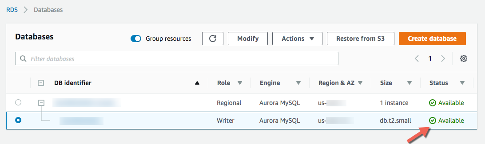
17. Click your DB Instance (Writer Role), Connectivity, Security, and check if **VPS security groups** are <span style="color:red">`( active )`</span>

---

## Add IAM Role to Aurora Cluster

1.  Go to **RDS Console** and click Databases.
2.  Click your new DB identifier **Role Regional**, then scroll down to **Manage IAM roles**.
    > 
3.  Under **Add IAM roles to this cluster** select the role you created: <span style="color:red">`RDSLoadFromS3`</span> and click **Add role** button.
    > 
4.  Wait until you see Status **ACTIVE**.

---

## Verify Instance Configuration

1.  Go to [RDS console](https://console.aws.amazon.com/rds/) and click Databases.
2.  Verify instance (Writer Role) Status is **Available**
3.  Click your instance (Writer Role).
4.  Connectivity tab, verify the following:
    > VPC security groups: **rds-launch-wizard (sg-XXXXXXXX) ( active )**
    >
    > Public accessibility: **Yes**
5.  Configuration tab, verify the following:
    > Parameter group: **instanceallowawsaccess (in-sync)**
6.  Go back to Databases and click your cluster (Regional Role), verify the following:
    > DB cluster parameter group: **clusterallowawsaccess (in-sync)**

---

## Test MySQL Connection

1.  Download and install any **MySQL client** of your preference:
    ```sql
    For Mac you may use "Sequel Pro" or "MySQL Workbench"
    For Windows you may use "MySQL Workbench" or "HeidiSQL"
    ```
2.  Go to [RDS console](https://console.aws.amazon.com/rds/), then Databases, click your new cluster (Regional Role).
3.  Under Connectivity tab copy the **Writer** endpoint name string.
4.  Launch your MySQL client and configure a new connection:
    > **Host:** Paste the Writer endpoint string.
    >
    > **Username:** root
    >
    > **Password:** type the Master Password
    >
    > **Port:** 3306
    >
    > **Database:** Leave blank
    >
    > **Connect using SSL:** No
5.  Click Connect and verify that you can successfully connect to your RDS instance.

---

## Setup Factor BI Console

Click and follow steps to [create your account with Factor BI.](/console)

---

## Using other MySQL Users

If you don't want to use <span style="color:red">`root`</span> account for the synchronization API, then you may create a new user and password on MySQL and:

1.  Give the new user: <span style="color:red">`GRANT LOAD FROM S3 ON *.* TO 'mynewuser';`</span>
2.  Set the following Global Privileges:
    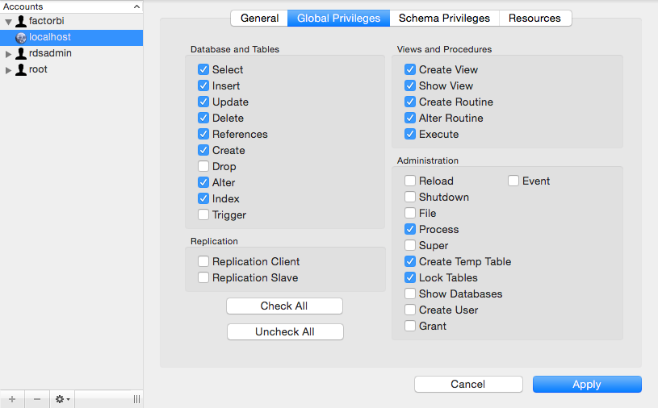

---

## Console Access to Bucket

Bipost synchronization uses S3 to upload the data that is extracted from the on-prem database. The bucket is located within Factor BI AWS account so we can efficiently handle API calls, patches and new releases.

We create a unique S3 bucket for each customer so nothing gets mixed up.

Sometimes you may want to access this bucket and review files and folders.

Write us to provide this access: [info@factorbi.com](mailto:info@factorbi.com)