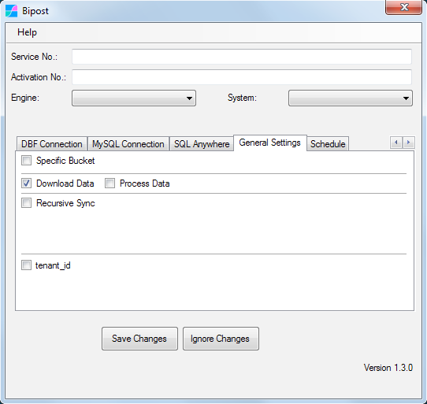
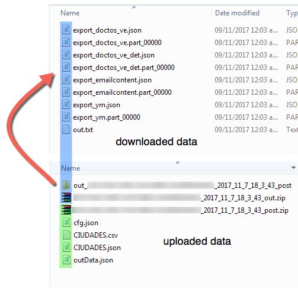
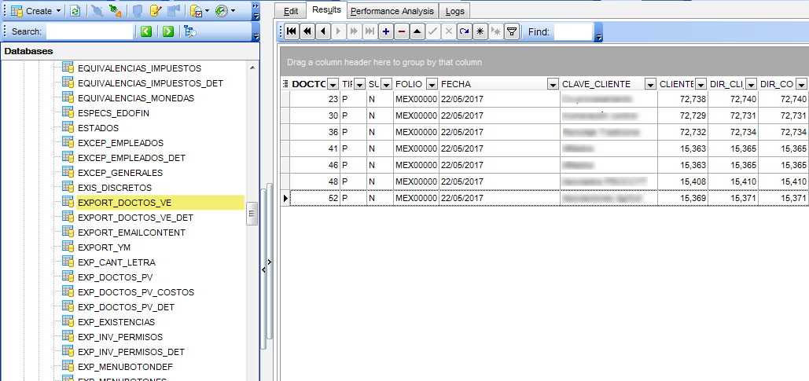

## Download Data to On-Prem

In some cases Aurora-MySQL is used to make transactions with web applications. In this case it is useful to download data sets from Aurora-MySQL to on-premises.



*   With this option you are able to download data from Aurora to on-premises Windows.
*   Data to retrieve from Aurora is specified on **outData.json**
*   Process Data is used to update/insert returned data to SQL Server or Firebird SQL. This option is not supported for DBF files.

---

## outData.json

*   With this file you are able to specify tables, fields and filter criteria to extract data from Aurora.
*   MySQL tables are case-sensitive, so this is important on <span style="color:red">`"table":`</span> parameter.
*   Downloaded data will be available on <span style="color:red">`%localappdata%/biPost/out_`</span> Windows folder.
*   <span style="color:red">`recursiveDateField`</span> parameter not supported.

**We highly recommend to prepare your data set on separate non-transactional tables, and process them with [Bipost API Final Statement.](/bipostapi#4-transform-data-after-loading)**

**Example 1, using outData.json**
```json
{
    "out": [
    {
        "active": "true",
        "table": "export_doctos_ve",
        "fields": "*",
        "filter": "",
        "recursiveDateField": ""
    },
    {
        "active": "true",
        "table": "export_doctos_ve_det",
        "fields": "*",
        "filter": "",
        "recursiveDateField": ""
    },
    {
        "active": "true",
        "table": "export_doctos_cm",
        "fields": "*",
        "filter": "",
        "recursiveDateField": ""
    },
    {
        "active": "true",
        "table": "export_doctos_cm_det",
        "fields": "*",
        "filter": "",
        "recursiveDateField": ""
    }
    ],
    "initialQuery": "",
    "finalQuery": ""
}
```

**Example 2, using outData.json**
```json
{
    "out": [
    {
        "active": "true",
        "table": "biArticulos",
        "fields": "*",
        "filter": "linea = 'TVs'",
        "recursiveDateField": ""
    },
    {
        "active": "",
        "table": "",
        "fields": "",
        "filter": "",
        "recursiveDateField": ""
    }
    ],
    "initialQuery": "",
    "finalQuery": ""
}
```

> Note that you can leave <span style="color:red">`"active": "",`</span> empty.

Example of downloaded data on <span style="color:red">`%localappdata%/bipost`</span> folder:



---

## Process Data

*   When this option is on, table schema's are created/altered and data uploaded to your SQL Server or Firebird SQL.
*   Same names of output tables on Aurora are created on SQL Server/Firebird.
*   We highly recommend to create specific output tables on Aurora and give them a name that is not in use on your SQL Server/Firebird database.
*   Primary keys on Aurora are used on SQL Server/Firebird to avoid duplicates.
*   You are able to query views from Aurora as output. In this case tables on SQL Server/Firebird are always deleted before any new data load.
*   Schema changes on Aurora are applied to SQL Server/Firebird, except for deleting and renaming columns.
*   Run queries before and after data is loaded to SQL Server/Firebird, more instructions below.
*   [Firebird SQL does not naturally support creating a column name starting with underscore,](/troubleshooting#firebird-column-name-starts-with-underscore) so avoid that on Aurora if your on-prem DB is Firebird.

Example of processed data: tables were created and data loaded.



---

## Initial and Final Query

Before and after data is loaded to SQL Server/Firebird you're able to run queries, example:

```json
{
      "out": [
    {
        "active": "true",
        "table": "biArticulos",
        "fields": "*",
        "filter": "linea = 'TVs'",
        "recursiveDateField": ""
    }
    ],
      "initialQuery": "execute procedure spInitial;",
      "finalQuery": "execute procedure spFinal;"
}
```

<span style="color:red">`initialQuery`</span> and <span style="color:red">`finalQuery`</span> are used to transform your data in any way you want.