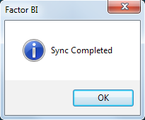
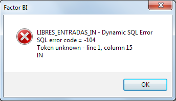
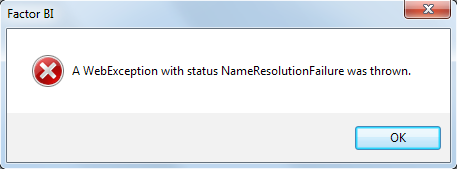
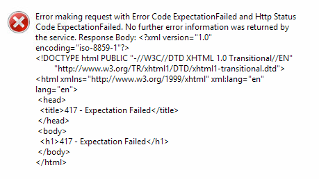
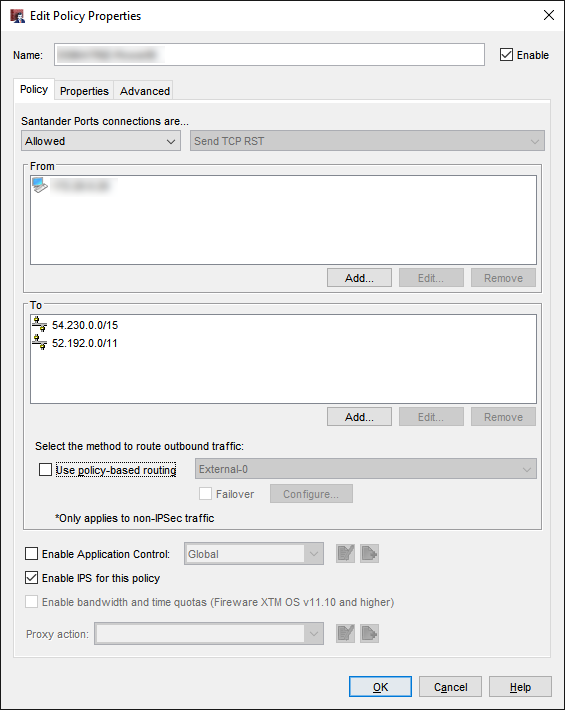
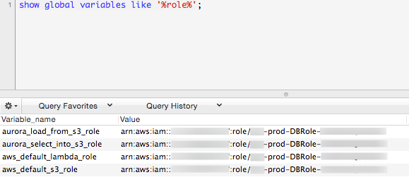
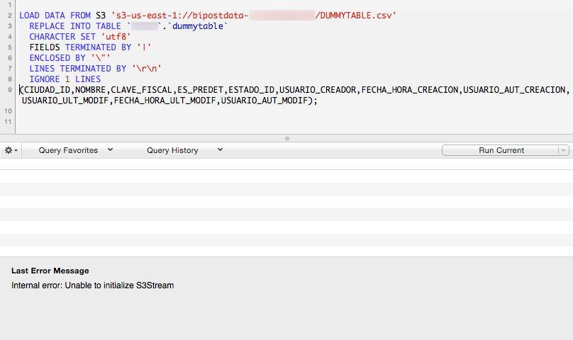
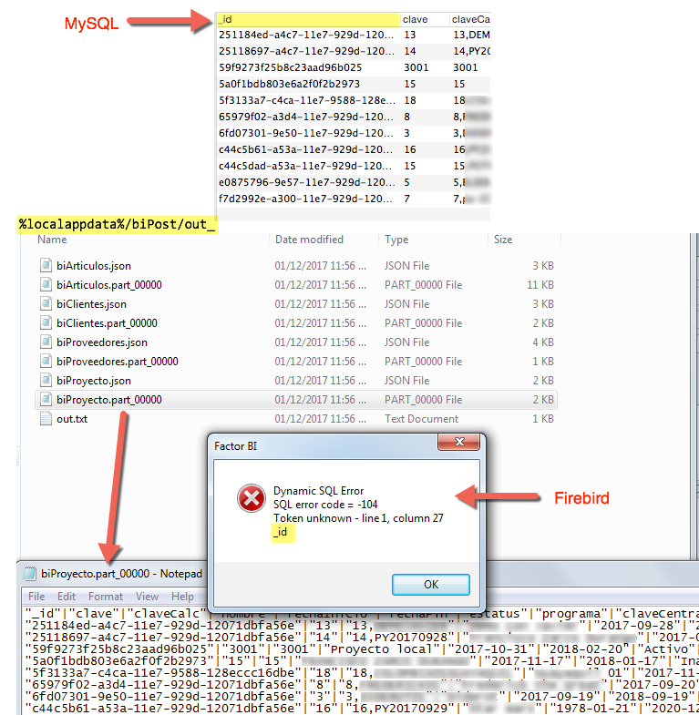

## Troubleshooting

A successful synchronization shows the following dialog.



If you face any errors, try looking here.

---

## Syntax error

Misspelled fields or tables on customData.json may appear as:



---

## No Internet Connection

When no internet connection available, the following message appears:



---

## Firewall Restrictions

If your internet connection has a firewall, it may show different errors like:

*   The remote name could not be resolved.
*   A WebException with status SendFailure was thrown.
*   A WebException with status NameResolutionFailure was thrown.
*   Error making request with Error Code ExpectationFailed and Http Status Code ExpectationFailed.



### Grant Firewall to reach Amazon S3

Create a policy to Allow to:

*   <span style="color:red">`54.230.0.0/15`</span>
*   <span style="color:red">`52.192.0.0/11`</span>



AWS can have multiple IP addresses for S3 service, so in case the above IP's don't work check the <a href="https://aws.amazon.com/blogs/aws/aws-ip-ranges-json/" target="_blank">AWS Public IP Address Ranges documentation</a> and look for

```json
  "region": "GLOBAL",
  "service": "AMAZON"
```

and

```json
  "region": "us-east-1",
  "service": "AMAZON"
```

[https://ip-ranges.amazonaws.com/ip-ranges.json](https://ip-ranges.amazonaws.com/ip-ranges.json)

---

## No information to Sync

If <span style="color:red">`No information to Sync`</span> message appears, verify that customData.json is set to send at least one table.

---

## Waiting time

Bipost Sync may take from a few seconds to several minutes to extract from on-prem DB and upload to AWS. While this is happening no messages/icons will show that biPost.exe is working and maybe you'll see <span style="color:red">`(Not responding)`</span> on the top of the window, this is normal.

If you launch Windows Task Manager probably you'll see that <span style="color:red">`biPost.exe *32`</span> is running and consuming a considerable amount of CPU.

Once the information is uploaded to AWS, it is usually available on Aurora-MySQL very fast. If a big data set was uploaded it may take up to 5 minutes to be available on Aurora.

Verify which tables where loaded by querying <span style="color:red">`aurora_s3_load_history`</span> table like this:

```sql
SELECT * FROM mysql.aurora_s3_load_history WHERE file_name REGEXP 'mytablename' ORDER BY load_timestamp desc;
```

Optionally convert <span style="color:red">`load_timestamp`</span> to your local time, e.g.: <span style="color:red">`CONVERT_TZ(load_timestamp,'UTC','America/Mexico_City')`</span>

---

## Upload Limit

Depending on the number of rows and columns on each table, it is possible that a large amount of data sent on a single sync may not load to Aurora-MySQL.

We have tested up to 1.5 million rows on a single sync or 280 MB uncompressed files.

We recommend using [Recursive Sync](/customdatajson) for big tables that have a date field available.

---

## Special Characters

Line breaks are not supported and thus removed.

---

## Schema Limitations

Only tables with a <span style="color:red">`PRIMARY KEY`</span> are available to synchronize. If a table does not have a PRIMARY KEY an error message will appear.

As a workaround, you can manually create the tables with a PRIMARY KEY on Aurora-MySQL and then synchronize. On-prem schema changes (e.g. adding columns) will not synchronize unless on-prem tables use primary keys.

---

## MySQL schemas are created but no data is loaded

Two things might be causing this problem:

#### 1. RDS instance cannot reach S3 bucket.

When we look at our CloudWatch logs, we see <span style="color:red">`Unable to initialize S3Stream`</span>, so do the following:

*   Go to [RDS Clusters](/easyawssetup#step-5-add-role-to-cluster) and check if **IAM Role** is listed and active for your cluster.

If you **manually** created AWS Services then:

*   Check if your [IAM Policy to Grant Access to S3](/setupaws#iam-policy-to-grant-access-to-s3) is set correctly using the S3 bucket ARN we provided. Also double check the policy document (JSON).
*   Check that [IAM Role](/setupaws#iam-role-to-load-data-from-s3) has attached the former IAM Policy. Copy ARN Role to a notepad for next steps.
*   Go to [RDS Parameter Groups](/setupaws#create-cluster-parameter-group), select the cluster group and click **Compare Parameters**, it should show the IAM ARN Role (the one you just copied on a notepad) on the parameters shown [here.](/setupaws#create-cluster-parameter-group)
*   Double check IAM roles attached to your instance querying <span style="color:red">`show global variables like '%role%'`</span>



After this, if you still experience this error, check out [Manually debugging S3Stream.](/troubleshooting#debugging-s3stream)

#### 2. Name of your MySQL database must be all lower case.

When we look at our CloudWatch logs, we see:

<span style="color:red">`SequelizeConnectionError: ER_BAD_DB_ERROR: Unknown database`</span>

Double check that your DB name is all lower case.

---

## Debugging S3Stream

In this section we will manually upload data to Aurora-MySQL. The goal here is to see whether an error is shown while directly importing data from S3 to Aurora-MySQL.

#### Create Dummy Table

Using MySQL Workbench open a connection to your MySQL instance using <span style="color:red">`root`</span> account.

Let's create a dummy table:

```sql
CREATE TABLE `dummytable` (
  `CIUDAD_ID` int(4) NOT NULL,
  `NOMBRE` varchar(50) COLLATE latin1_spanish_ci NOT NULL,
  `CLAVE_FISCAL` varchar(3) COLLATE latin1_spanish_ci DEFAULT NULL,
  `ES_PREDET` char(1) COLLATE latin1_spanish_ci DEFAULT NULL,
  `ESTADO_ID` int(4) NOT NULL,
  `USUARIO_CREADOR` varchar(31) COLLATE latin1_spanish_ci DEFAULT NULL,
  `FECHA_HORA_CREACION` datetime DEFAULT NULL,
  `USUARIO_AUT_CREACION` varchar(31) COLLATE latin1_spanish_ci DEFAULT NULL,
  `USUARIO_ULT_MODIF` varchar(31) COLLATE latin1_spanish_ci DEFAULT NULL,
  `FECHA_HORA_ULT_MODIF` datetime DEFAULT NULL,
  `USUARIO_AUT_MODIF` varchar(31) COLLATE latin1_spanish_ci DEFAULT NULL,
  PRIMARY KEY (`CIUDAD_ID`)
) ENGINE=InnoDB DEFAULT CHARSET=latin1 COLLATE=latin1_spanish_ci;
```

#### LOAD DATA FROM S3

Replace curly brackets with your parameters:

*   **my-bucket-name**: Name of your dedicated bucket.
*   **my-database-name**: Name of your database on MySQL.

Now run on Workbench:

```sql
LOAD DATA FROM S3 's3-us-east-1://{my-bucket-name}/DUMMYTABLE.csv'
REPLACE INTO TABLE `{my-database-name}`.`dummytable`
CHARACTER SET 'utf8'
FIELDS TERMINATED BY '|'
ENCLOSED BY '"'
LINES TERMINATED BY '\r\n'
IGNORE 1 LINES
(CIUDAD_ID,NOMBRE,CLAVE_FISCAL,ES_PREDET,ESTADO_ID,USUARIO_CREADOR,FECHA_HORA_CREACION,USUARIO_AUT_CREACION,USUARIO_ULT_MODIF,FECHA_HORA_ULT_MODIF,USUARIO_AUT_MODIF);
```

**Example**

```sql
LOAD DATA FROM S3 's3-us-east-1://bipostdata-123456789012/DUMMYTABLE.csv'
REPLACE INTO TABLE `mytestdb`.`dummytable`
CHARACTER SET 'utf8'
FIELDS TERMINATED BY '|'
ENCLOSED BY '"'
LINES TERMINATED BY '\r\n'
IGNORE 1 LINES
(CIUDAD_ID,NOMBRE,CLAVE_FISCAL,ES_PREDET,ESTADO_ID,USUARIO_CREADOR,FECHA_HORA_CREACION,USUARIO_AUT_CREACION,USUARIO_ULT_MODIF,FECHA_HORA_ULT_MODIF,USUARIO_AUT_MODIF);
```



---

## LOAD FROM S3 privileges

The Aurora user that executes **LOAD DATA FROM S3** requires the following privilege:

<span style="color:red">`GRANT LOAD FROM S3 ON *.* TO 'your-user-name';`</span>

By default this privilege is set to your **Master Username** when you [created your Aurora instance.](/setupaws#aurora-instance)

If you are using a different user and the privilege is not set, the following error appears:

<span style="color:red">`Access denied; you need (at least one of) the LOAD FROM S3 privilege(s) for this operation`</span>

The only way to see this error is executing **LOAD FROM S3** [manually.](/troubleshooting#debugging-s3stream)

If your MySQL user already has this privilege and you see the following error, try [these steps.](/troubleshooting#1-rds-instance-cannot-reach-s3-bucket)

<span style="color:red">`Access denied for user 'your-user-name'@'xx.xx.xxx.xxx' (using password: YES)`</span>

---

## Firebird column name starts with underscore

Firebird SQL does not naturally support creating colums names starting with underscore, so avoid that on Aurora if your on-prem DB is Firebird.

<span style="color:red">`Token unknown - line 1`</span>



---

## Need more help?

Please send us an email to: [info@factorbi.com](mailto:info@factorbi.com)